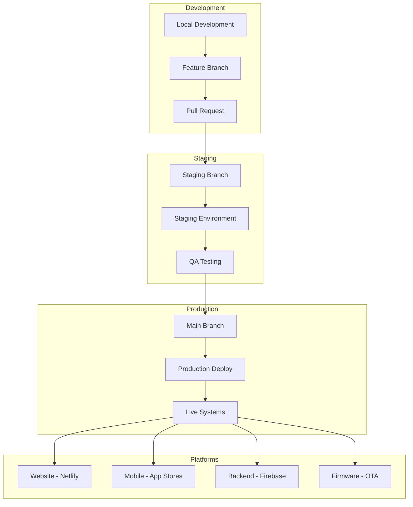

# 🚀 DAMP Smart Drinkware - Deployment Guide

## 🎯 **Deployment Overview**

This comprehensive guide covers all deployment scenarios for the DAMP Smart Drinkware ecosystem, including mobile applications, web platforms, backend services, and IoT device firmware.

## 🏗️ **Deployment Architecture**



## 🌐 **Website Deployment (Netlify)**

### **Automatic Deployment**
The website automatically deploys when code is pushed to the `main` branch.

**Current Configuration:**
- **Build Command**: `cd 'mobile-app/Original DAMP Smart Drinkware App' && npm install && npm run build:netlify:production`
- **Publish Directory**: `mobile-app/Original DAMP Smart Drinkware App/dist`
- **Domain**: [dampdrink.com](https://dampdrink.com)

### **Manual Deployment**
```bash
# From project root
cd "mobile-app/Original DAMP Smart Drinkware App"

# Install dependencies
npm install

# Build for production
npm run build:netlify:production

# Deploy to Netlify (if needed manually)
npx netlify deploy --prod --dir=dist
```

### **Environment Variables Setup**
```bash
# Set environment variables in Netlify Dashboard or via CLI
npx netlify env:set EXPO_PUBLIC_FIREBASE_API_KEY "your_api_key"
npx netlify env:set EXPO_PUBLIC_FIREBASE_PROJECT_ID "damp-smart-drinkware"
npx netlify env:set EXPO_PUBLIC_FIREBASE_AUTH_DOMAIN "damp-smart-drinkware.firebaseapp.com"
npx netlify env:set EXPO_PUBLIC_FIREBASE_STORAGE_BUCKET "damp-smart-drinkware.firebasestorage.app"
npx netlify env:set EXPO_PUBLIC_FIREBASE_MESSAGING_SENDER_ID "309818614427"
npx netlify env:set EXPO_PUBLIC_FIREBASE_APP_ID "1:309818614427:web:db15a4851c05e58aa25c3e"
npx netlify env:set EXPO_PUBLIC_FIREBASE_MEASUREMENT_ID "G-YW2BN4SVPQ"
npx netlify env:set EXPO_PUBLIC_PLATFORM "web"
npx netlify env:set EXPO_PUBLIC_ENVIRONMENT "production"
npx netlify env:set EXPO_PUBLIC_ADMIN_EMAIL "zach@wecr8.info"
npx netlify env:set NETLIFY_NEXT_PLUGIN_SKIP "true"
```

### **Netlify Configuration**
```toml
# netlify.toml
[build]
  command = "cd 'mobile-app/Original DAMP Smart Drinkware App' && npm install && npm run build:netlify:production"
  publish = "mobile-app/Original DAMP Smart Drinkware App/dist"

[build.environment]
  NODE_VERSION = "18"
  NETLIFY_NEXT_PLUGIN_SKIP = "true"

# Security headers
[[headers]]
  for = "/*"
  [headers.values]
    X-Frame-Options = "DENY"
    X-XSS-Protection = "1; mode=block"
    X-Content-Type-Options = "nosniff"
    Referrer-Policy = "strict-origin-when-cross-origin"
    Strict-Transport-Security = "max-age=31536000; includeSubDomains; preload"

# Client-side routing
[[redirects]]
  from = "/*"
  to = "/index.html"
  status = 200
```

## 📱 **Mobile App Deployment**

### **Prerequisites**
```bash
# Install required tools
npm install -g @expo/cli
npm install -g eas-cli

# Login to Expo
eas login

# Initialize EAS (if not already done)
eas init --id 96c7835d-aa09-48b6-8719-d1a5f8b24095
```

### **Development Builds**
```bash
cd "mobile-app/Original DAMP Smart Drinkware App"

# Start development server
npm run dev

# Run on specific platforms
npm run ios      # iOS simulator
npm run android  # Android emulator
npm run web      # Web browser
```

### **Production Builds**
```bash
# Build for all platforms
eas build --platform all

# Build for specific platform
eas build --platform ios
eas build --platform android

# Build with specific profile
eas build --platform ios --profile production
```

### **App Store Submission**
```bash
# Submit to app stores
eas submit --platform all

# Submit to specific store
eas submit --platform ios
eas submit --platform android

# Check submission status
eas submit --status
```

### **EAS Configuration**
```json
{
  "cli": {
    "version": ">= 5.2.0"
  },
  "build": {
    "development": {
      "developmentClient": true,
      "distribution": "internal",
      "ios": {
        "buildConfiguration": "Debug"
      },
      "android": {
        "buildType": "apk"
      }
    },
    "preview": {
      "distribution": "internal",
      "ios": {
        "buildConfiguration": "Release"
      },
      "android": {
        "buildType": "apk"
      }
    },
    "production": {
      "ios": {
        "buildConfiguration": "Release"
      },
      "android": {
        "buildType": "app-bundle"
      }
    }
  },
  "submit": {
    "production": {
      "ios": {
        "appleId": "zach@wecr8.info",
        "ascAppId": "your_app_store_connect_app_id",
        "appleTeamId": "your_apple_team_id"
      },
      "android": {
        "serviceAccountKeyPath": "./path/to/service-account-key.json",
        "track": "production"
      }
    }
  }
}
```

## 🔥 **Firebase Backend Deployment**

### **Prerequisites**
```bash
# Install Firebase CLI
npm install -g firebase-tools

# Login to Firebase
firebase login

# Select project
firebase use damp-smart-drinkware
```

### **Cloud Functions Deployment**
```bash
# Deploy all functions
firebase deploy --only functions

# Deploy specific function
firebase deploy --only functions:secureVoteSubmission

# Deploy with specific project
firebase deploy --only functions --project damp-smart-drinkware
```

### **Firestore Rules Deployment**
```bash
# Deploy Firestore security rules
firebase deploy --only firestore:rules

# Deploy Firestore indexes
firebase deploy --only firestore:indexes
```

### **Storage Rules Deployment**
```bash
# Deploy Storage security rules
firebase deploy --only storage
```

### **Complete Firebase Deployment**
```bash
# Deploy everything
firebase deploy

# Deploy with confirmation
firebase deploy --project damp-smart-drinkware
```

### **Firebase Configuration**
```json
{
  "projects": {
    "default": "damp-smart-drinkware"
  },
  "functions": {
    "source": "functions",
    "predeploy": [
      "npm --prefix functions install",
      "npm --prefix functions run build"
    ]
  },
  "firestore": {
    "rules": "firestore.rules",
    "indexes": "firestore.indexes.json"
  },
  "storage": {
    "rules": "storage.rules"
  },
  "hosting": {
    "public": "public",
    "ignore": [
      "firebase.json",
      "**/.*",
      "**/node_modules/**"
    ]
  }
}
```

## 🛠️ **Firmware Deployment (IoT Devices)**

### **Over-the-Air (OTA) Updates**
```c
// Example: OTA update implementation
#include "esp_ota_ops.h"
#include "esp_https_ota.h"

esp_err_t perform_ota_update(const char* firmware_url) {
    esp_http_client_config_t config = {
        .url = firmware_url,
        .cert_pem = server_cert_pem_start,
        .timeout_ms = 30000,
        .keep_alive_enable = true,
    };

    esp_https_ota_config_t ota_config = {
        .http_config = &config,
    };

    esp_err_t ret = esp_https_ota(&ota_config);
    if (ret == ESP_OK) {
        esp_restart();
    }

    return ret;
}
```

### **Device Provisioning**
```bash
# Flash initial firmware
esptool.py --port /dev/ttyUSB0 write_flash 0x10000 firmware.bin

# Configure device credentials
python provision_device.py --device-id DAMP001 --certificate device.crt
```

## 🔄 **CI/CD Pipeline**

### **GitHub Actions Workflow**
```yaml
name: Deploy DAMP Smart Drinkware

on:
  push:
    branches: [main]
  pull_request:
    branches: [main]

jobs:
  test:
    runs-on: ubuntu-latest
    steps:
      - uses: actions/checkout@v3
      - uses: actions/setup-node@v3
        with:
          node-version: '18'
      - run: cd "mobile-app/Original DAMP Smart Drinkware App" && npm install
      - run: cd "mobile-app/Original DAMP Smart Drinkware App" && npm test

  deploy-website:
    needs: test
    runs-on: ubuntu-latest
    if: github.ref == 'refs/heads/main'
    steps:
      - uses: actions/checkout@v3
      - name: Deploy to Netlify
        run: |
          cd "mobile-app/Original DAMP Smart Drinkware App"
          npm install
          npm run build:netlify:production
        env:
          EXPO_PUBLIC_FIREBASE_API_KEY: ${{ secrets.FIREBASE_API_KEY }}
          EXPO_PUBLIC_FIREBASE_PROJECT_ID: ${{ secrets.FIREBASE_PROJECT_ID }}

  deploy-functions:
    needs: test
    runs-on: ubuntu-latest
    if: github.ref == 'refs/heads/main'
    steps:
      - uses: actions/checkout@v3
      - uses: actions/setup-node@v3
        with:
          node-version: '18'
      - run: npm install -g firebase-tools
      - run: firebase deploy --only functions --token ${{ secrets.FIREBASE_TOKEN }}
```

## 📊 **Environment Management**

### **Environment Configurations**

| Environment | Purpose | URL | Database |
|-------------|---------|-----|----------|
| **Development** | Local development | localhost:3000 | Firebase Emulator |
| **Staging** | Pre-production testing | staging.dampdrink.com | Firebase Staging |
| **Production** | Live system | dampdrink.com | Firebase Production |

### **Environment Variables**
```bash
# Development (.env.development)
EXPO_PUBLIC_ENVIRONMENT=development
EXPO_PUBLIC_FIREBASE_PROJECT_ID=damp-smart-drinkware-dev
EXPO_PUBLIC_API_URL=http://localhost:5001

# Staging (.env.staging)
EXPO_PUBLIC_ENVIRONMENT=staging
EXPO_PUBLIC_FIREBASE_PROJECT_ID=damp-smart-drinkware-staging
EXPO_PUBLIC_API_URL=https://staging-api.dampdrink.com

# Production (.env.production)
EXPO_PUBLIC_ENVIRONMENT=production
EXPO_PUBLIC_FIREBASE_PROJECT_ID=damp-smart-drinkware
EXPO_PUBLIC_API_URL=https://api.dampdrink.com
```

## 🔍 **Monitoring & Health Checks**

### **Website Health Check**
```javascript
// health-check.js
const healthCheck = async () => {
  const checks = [
    { name: 'Website', url: 'https://dampdrink.com' },
    { name: 'API', url: 'https://api.dampdrink.com/health' },
    { name: 'Firebase', url: 'https://damp-smart-drinkware.firebaseapp.com' }
  ];

  for (const check of checks) {
    try {
      const response = await fetch(check.url);
      console.log(`✅ ${check.name}: ${response.status}`);
    } catch (error) {
      console.error(`❌ ${check.name}: ${error.message}`);
    }
  }
};

healthCheck();
```

### **Deployment Verification**
```bash
#!/bin/bash
# verify-deployment.sh

echo "🔍 Verifying deployment..."

# Check website
if curl -f -s https://dampdrink.com > /dev/null; then
    echo "✅ Website is accessible"
else
    echo "❌ Website is not accessible"
    exit 1
fi

# Check Firebase functions
if curl -f -s https://us-central1-damp-smart-drinkware.cloudfunctions.net/api/health > /dev/null; then
    echo "✅ Firebase functions are accessible"
else
    echo "❌ Firebase functions are not accessible"
    exit 1
fi

echo "🎉 Deployment verification completed successfully"
```

## 🚨 **Rollback Procedures**

### **Website Rollback**
```bash
# Rollback to previous Netlify deployment
npx netlify api listSiteDeploys
npx netlify api restoreSiteDeploy --deploy-id PREVIOUS_DEPLOY_ID
```

### **Mobile App Rollback**
```bash
# Revert to previous app version
eas build --platform all --profile production --clear-cache
eas submit --platform all
```

### **Firebase Functions Rollback**
```bash
# List previous deployments
firebase functions:log

# Rollback to previous version (manual redeployment)
git checkout PREVIOUS_COMMIT
firebase deploy --only functions
```

## 📋 **Deployment Checklist**

### **Pre-Deployment**
- [ ] All tests passing
- [ ] Security scan completed
- [ ] Environment variables configured
- [ ] Database migrations ready
- [ ] Backup created
- [ ] Monitoring alerts configured

### **During Deployment**
- [ ] Deployment logs monitored
- [ ] Health checks passing
- [ ] Performance metrics stable
- [ ] Error rates normal
- [ ] User feedback monitored

### **Post-Deployment**
- [ ] Functionality verified
- [ ] Performance benchmarks met
- [ ] Security scan passed
- [ ] Documentation updated
- [ ] Team notified
- [ ] Rollback plan confirmed

## 🔧 **Troubleshooting**

### **Common Deployment Issues**

| Issue | Cause | Solution |
|-------|-------|----------|
| Build fails | Missing dependencies | Run `npm install` and check package.json |
| Environment variables missing | Not set in deployment platform | Configure in Netlify/EAS dashboard |
| Firebase functions timeout | Cold start or resource limits | Optimize function code or increase timeout |
| Mobile build fails | Certificate/provisioning issues | Update certificates in EAS dashboard |
| Website 404 errors | Routing configuration | Check `_redirects` file or netlify.toml |

### **Emergency Contacts**
- **Primary**: zach@wecr8.info
- **Backup**: support@wecr8.info
- **Emergency**: Available 24/7 for critical issues

## 📚 **Additional Resources**

### **Documentation Links**
- [Netlify Deployment Docs](https://docs.netlify.com/site-deploys/overview/)
- [Expo EAS Build Docs](https://docs.expo.dev/build/introduction/)
- [Firebase Deployment Docs](https://firebase.google.com/docs/cli)
- [React Native Deployment Guide](https://reactnative.dev/docs/signed-apk-android)

### **Monitoring Tools**
- **Netlify Analytics**: Built-in deployment monitoring
- **Firebase Console**: Function logs and performance
- **Expo Dashboard**: Build status and analytics
- **Custom Health Checks**: Automated monitoring scripts

---

**Deployment is a critical process. Always follow the checklist and have a rollback plan ready.**

*Last Updated: 2024-12-19 - Deployment Guide v1.0*