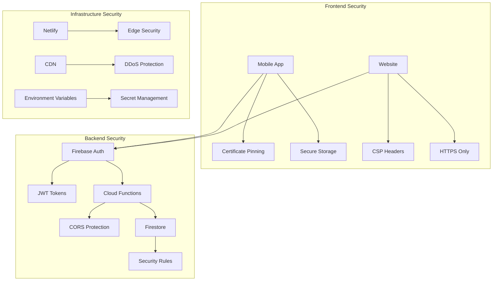

# 🔒 DAMP Smart Drinkware - Security Documentation

## 🛡️ **Security Overview**

This document outlines the comprehensive security measures implemented across the DAMP Smart Drinkware ecosystem, including mobile applications, web platforms, IoT devices, and backend services.

## 🏗️ **Security Architecture**



## 🔐 **Authentication & Authorization**

### **Firebase Authentication**
- **Multi-factor Authentication**: Email/password with optional 2FA
- **JWT Tokens**: Secure, short-lived tokens with automatic refresh
- **Session Management**: Secure session handling with automatic expiration
- **Password Security**: Bcrypt hashing with salt rounds

```javascript
// Example: Secure authentication implementation
import { signInWithEmailAndPassword, getAuth } from 'firebase/auth';

const secureLogin = async (email, password) => {
  try {
    const auth = getAuth();
    const userCredential = await signInWithEmailAndPassword(auth, email, password);

    // Token automatically managed by Firebase SDK
    const idToken = await userCredential.user.getIdToken();

    // Store minimal user data locally
    const userData = {
      uid: userCredential.user.uid,
      email: userCredential.user.email,
      lastLogin: new Date().toISOString()
    };

    return { success: true, user: userData };
  } catch (error) {
    // Never expose internal error details
    console.error('Authentication failed:', error);
    return { success: false, error: 'Invalid credentials' };
  }
};
```

### **Authorization Levels**
| Role | Permissions | Access Level |
|------|-------------|--------------|
| **Guest** | View products, vote anonymously | Public |
| **User** | Account management, device pairing, purchases | Authenticated |
| **Premium** | Advanced analytics, priority support | Subscription |
| **Admin** | User management, analytics, system config | Administrative |

## 🌐 **Web Security**

### **Content Security Policy (CSP)**
```http
Content-Security-Policy:
  default-src 'self';
  script-src 'self' 'unsafe-inline' 'unsafe-eval'
    https://www.googletagmanager.com
    https://js.stripe.com
    https://checkout.stripe.com;
  style-src 'self' 'unsafe-inline'
    https://fonts.googleapis.com;
  img-src 'self' data: blob:
    https://www.googletagmanager.com
    https://images.unsplash.com;
  connect-src 'self'
    https://api.stripe.com
    https://checkout.stripe.com
    https://dampdrink.com;
  font-src 'self' https://fonts.gstatic.com;
  object-src 'none';
  base-uri 'self';
  form-action 'self' https://checkout.stripe.com;
  frame-ancestors 'none';
  upgrade-insecure-requests;
```

### **Security Headers**
```http
# Security Headers Configuration
Strict-Transport-Security: max-age=31536000; includeSubDomains; preload
X-Frame-Options: DENY
X-Content-Type-Options: nosniff
X-XSS-Protection: 1; mode=block
Referrer-Policy: strict-origin-when-cross-origin
Cross-Origin-Embedder-Policy: require-corp
Cross-Origin-Opener-Policy: same-origin
Cross-Origin-Resource-Policy: same-origin
Permissions-Policy: accelerometer=(), camera=(), geolocation=(self), gyroscope=(), magnetometer=(), microphone=(), payment=(), usb=()
```

### **Input Validation & Sanitization**
```javascript
// Example: Input validation for voting system
const validateVoteInput = (productId, userId) => {
  // Sanitize inputs
  const sanitizedProductId = productId.toString().replace(/[^a-zA-Z0-9-]/g, '');
  const sanitizedUserId = userId.toString().replace(/[^a-zA-Z0-9-]/g, '');

  // Validate format
  if (!/^[a-zA-Z0-9-]{1,50}$/.test(sanitizedProductId)) {
    throw new Error('Invalid product ID format');
  }

  if (!/^[a-zA-Z0-9-]{1,50}$/.test(sanitizedUserId)) {
    throw new Error('Invalid user ID format');
  }

  return { productId: sanitizedProductId, userId: sanitizedUserId };
};
```

## 📱 **Mobile Security**

### **App Transport Security (ATS)**
```xml
<!-- iOS: Info.plist ATS Configuration -->
<key>NSAppTransportSecurity</key>
<dict>
    <key>NSAllowsArbitraryLoads</key>
    <false/>
    <key>NSExceptionDomains</key>
    <dict>
        <key>dampdrink.com</key>
        <dict>
            <key>NSExceptionRequiresForwardSecrecy</key>
            <false/>
            <key>NSExceptionMinimumTLSVersion</key>
            <string>TLSv1.2</string>
        </dict>
    </dict>
</dict>
```

### **Secure Storage**
```javascript
// Example: Secure token storage
import * as SecureStore from 'expo-secure-store';

const storeSecureToken = async (token) => {
  try {
    await SecureStore.setItemAsync('auth_token', token, {
      requireAuthentication: true,
      authenticationPrompt: 'Authenticate to access your account',
    });
  } catch (error) {
    console.error('Secure storage failed:', error);
  }
};

const getSecureToken = async () => {
  try {
    return await SecureStore.getItemAsync('auth_token');
  } catch (error) {
    console.error('Secure retrieval failed:', error);
    return null;
  }
};
```

### **Certificate Pinning**
```javascript
// Example: Certificate pinning for API calls
const secureApiCall = async (url, options = {}) => {
  const secureOptions = {
    ...options,
    headers: {
      ...options.headers,
      'Content-Type': 'application/json',
    },
    // Certificate pinning configuration
    agent: new https.Agent({
      ca: [EXPECTED_CERTIFICATE], // Pin expected certificate
      checkServerIdentity: (host, cert) => {
        // Additional certificate validation
        return tls.checkServerIdentity(host, cert);
      }
    })
  };

  return fetch(url, secureOptions);
};
```

## 🔥 **Firebase Security**

### **Firestore Security Rules**
```javascript
// Firestore Security Rules
rules_version = '2';
service cloud.firestore {
  match /databases/{database}/documents {
    // Users can only access their own data
    match /users/{userId} {
      allow read, write: if request.auth != null && request.auth.uid == userId;
    }

    // Voting is public read, authenticated write
    match /voting/{document} {
      allow read: if true;
      allow write: if request.auth != null
        && request.auth.uid != null
        && isValidVote(request.resource.data);
    }

    // Orders require authentication and ownership
    match /orders/{orderId} {
      allow read, write: if request.auth != null
        && request.auth.uid == resource.data.userId;
    }

    // Admin-only access
    match /admin/{document} {
      allow read, write: if request.auth != null
        && request.auth.token.admin == true;
    }
  }
}

// Validation functions
function isValidVote(data) {
  return data.keys().hasAll(['productId', 'userId', 'timestamp'])
    && data.productId is string
    && data.userId == request.auth.uid
    && data.timestamp is timestamp;
}
```

### **Cloud Functions Security**
```javascript
// Example: Secure Cloud Function
const functions = require('firebase-functions');
const admin = require('firebase-admin');
const cors = require('cors')({ origin: ['https://dampdrink.com'] });

exports.secureVoteSubmission = functions.https.onRequest((req, res) => {
  return cors(req, res, async () => {
    try {
      // Verify authentication
      const idToken = req.headers.authorization?.split('Bearer ')[1];
      if (!idToken) {
        return res.status(401).json({ error: 'Unauthorized' });
      }

      const decodedToken = await admin.auth().verifyIdToken(idToken);
      const userId = decodedToken.uid;

      // Rate limiting
      const recentVotes = await admin.firestore()
        .collection('voting')
        .where('userId', '==', userId)
        .where('timestamp', '>', new Date(Date.now() - 60000)) // 1 minute
        .get();

      if (recentVotes.size > 5) {
        return res.status(429).json({ error: 'Rate limit exceeded' });
      }

      // Validate and sanitize input
      const { productId } = req.body;
      if (!productId || typeof productId !== 'string') {
        return res.status(400).json({ error: 'Invalid input' });
      }

      // Process vote securely
      const voteData = {
        productId: productId.substring(0, 50), // Limit length
        userId,
        timestamp: admin.firestore.FieldValue.serverTimestamp(),
        ip: req.headers['x-forwarded-for'] || req.connection.remoteAddress
      };

      await admin.firestore().collection('voting').add(voteData);

      res.status(200).json({ success: true });
    } catch (error) {
      console.error('Vote submission error:', error);
      res.status(500).json({ error: 'Internal server error' });
    }
  });
});
```

## 🏭 **IoT Device Security**

### **Device Authentication**
```c
// Example: Device-to-cloud authentication
#include "mbedtls/pk.h"
#include "mbedtls/entropy.h"
#include "mbedtls/ctr_drbg.h"

typedef struct {
    char device_id[32];
    char private_key[2048];
    char certificate[2048];
} device_credentials_t;

int authenticate_device(device_credentials_t *creds) {
    // Generate secure device signature
    mbedtls_pk_context pk;
    mbedtls_entropy_context entropy;
    mbedtls_ctr_drbg_context ctr_drbg;

    // Initialize cryptographic contexts
    mbedtls_pk_init(&pk);
    mbedtls_entropy_init(&entropy);
    mbedtls_ctr_drbg_init(&ctr_drbg);

    // Load device private key
    int ret = mbedtls_pk_parse_key(&pk,
        (const unsigned char *)creds->private_key,
        strlen(creds->private_key) + 1, NULL, 0);

    if (ret != 0) {
        return -1; // Authentication failed
    }

    // Create device signature for authentication
    unsigned char signature[256];
    size_t sig_len;

    ret = mbedtls_pk_sign(&pk, MBEDTLS_MD_SHA256,
        (const unsigned char *)creds->device_id,
        strlen(creds->device_id),
        signature, &sig_len,
        mbedtls_ctr_drbg_random, &ctr_drbg);

    // Cleanup
    mbedtls_pk_free(&pk);
    mbedtls_entropy_free(&entropy);
    mbedtls_ctr_drbg_free(&ctr_drbg);

    return ret == 0 ? 0 : -1;
}
```

### **Secure Communication**
- **TLS 1.3**: All device-to-cloud communication encrypted
- **Certificate-based Authentication**: Each device has unique certificates
- **Message Integrity**: HMAC validation for all messages
- **Replay Protection**: Timestamp and nonce validation

## 💳 **Payment Security**

### **Stripe Integration**
```javascript
// Example: Secure payment processing
const stripe = require('stripe')(process.env.STRIPE_SECRET_KEY);

const createSecurePayment = async (amount, currency, customerId) => {
  try {
    // Validate inputs
    if (!amount || amount < 50) { // Minimum $0.50
      throw new Error('Invalid amount');
    }

    if (!['usd', 'eur', 'gbp'].includes(currency)) {
      throw new Error('Unsupported currency');
    }

    // Create payment intent with security features
    const paymentIntent = await stripe.paymentIntents.create({
      amount: Math.round(amount), // Prevent decimal attacks
      currency,
      customer: customerId,
      automatic_payment_methods: {
        enabled: true,
      },
      metadata: {
        timestamp: Date.now(),
        source: 'damp-app'
      },
      // Fraud prevention
      radar_options: {
        session: 'fraud_detection_enabled'
      }
    });

    return {
      client_secret: paymentIntent.client_secret,
      payment_intent_id: paymentIntent.id
    };
  } catch (error) {
    console.error('Payment creation failed:', error);
    throw new Error('Payment processing unavailable');
  }
};
```

### **PCI Compliance**
- **No Card Data Storage**: All payment data handled by Stripe
- **Secure Transmission**: TLS encryption for all payment communications
- **Tokenization**: Card details replaced with secure tokens
- **Audit Logging**: All payment events logged securely

## 🔐 **Environment Variables & Secrets Management**

### **Secure Environment Configuration**
```bash
# .env.example - Template for environment variables
# NEVER commit actual values to version control

# Firebase Configuration (Public - Safe to expose)
EXPO_PUBLIC_FIREBASE_API_KEY=your_firebase_api_key
EXPO_PUBLIC_FIREBASE_AUTH_DOMAIN=your_project.firebaseapp.com
EXPO_PUBLIC_FIREBASE_PROJECT_ID=your_project_id

# Private Configuration (Server-side only)
FIREBASE_ADMIN_SDK_KEY=path/to/service-account-key.json
STRIPE_SECRET_KEY=sk_test_your_stripe_secret_key
STRIPE_WEBHOOK_SECRET=whsec_your_webhook_secret

# Platform Configuration
EXPO_PUBLIC_PLATFORM=web|mobile
EXPO_PUBLIC_ENVIRONMENT=development|staging|production
```

### **Secrets Management Best Practices**
1. **Development**: Use `.env` files (gitignored)
2. **Staging/Production**: Use secure CI/CD environment variables
3. **Mobile**: Use Expo's secure environment variable system
4. **Rotation**: Regular key rotation schedule (quarterly)
5. **Access Control**: Principle of least privilege

## 📊 **Security Monitoring & Logging**

### **Security Event Logging**
```javascript
// Example: Security event logger
const securityLogger = {
  logAuthAttempt: (userId, success, ip, userAgent) => {
    const event = {
      type: 'auth_attempt',
      userId,
      success,
      ip,
      userAgent,
      timestamp: new Date().toISOString(),
      severity: success ? 'info' : 'warning'
    };

    // Log to secure monitoring system
    console.log(JSON.stringify(event));

    // Alert on suspicious activity
    if (!success) {
      checkForBruteForce(ip, userId);
    }
  },

  logDataAccess: (userId, resource, action) => {
    const event = {
      type: 'data_access',
      userId,
      resource,
      action,
      timestamp: new Date().toISOString(),
      severity: 'info'
    };

    console.log(JSON.stringify(event));
  }
};
```

### **Monitoring Alerts**
- **Failed Authentication**: >5 attempts in 5 minutes
- **Unusual Access Patterns**: Geographic anomalies
- **API Rate Limiting**: >100 requests/minute per user
- **Payment Anomalies**: Unusual transaction patterns
- **Device Tampering**: Unexpected device behavior

## 🚨 **Incident Response**

### **Security Incident Workflow**
1. **Detection**: Automated monitoring alerts
2. **Assessment**: Determine severity and impact
3. **Containment**: Isolate affected systems
4. **Investigation**: Root cause analysis
5. **Recovery**: Restore secure operations
6. **Lessons Learned**: Update security measures

### **Emergency Contacts**
- **Security Team**: security@wecr8.info
- **Admin Contact**: zach@wecr8.info
- **Emergency Response**: Available 24/7

## ✅ **Security Checklist**

### **Pre-Deployment Security Review**
- [ ] Authentication mechanisms tested
- [ ] Authorization rules validated
- [ ] Input validation implemented
- [ ] Security headers configured
- [ ] Secrets properly managed
- [ ] HTTPS/TLS enforced
- [ ] Error handling secure (no info leakage)
- [ ] Logging and monitoring active
- [ ] Backup and recovery tested
- [ ] Third-party dependencies audited

### **Regular Security Maintenance**
- [ ] Security patches applied monthly
- [ ] Access reviews quarterly
- [ ] Penetration testing annually
- [ ] Security training for team
- [ ] Incident response plan updated
- [ ] Compliance audits completed

## 📚 **Security Resources**

### **Standards & Frameworks**
- **OWASP Top 10**: Web application security risks
- **NIST Cybersecurity Framework**: Comprehensive security guidelines
- **PCI DSS**: Payment card industry standards
- **GDPR**: Data protection regulations
- **SOC 2**: Security operational controls

### **Security Tools**
- **Static Analysis**: ESLint security rules, Semgrep
- **Dependency Scanning**: npm audit, Snyk
- **Penetration Testing**: OWASP ZAP, Burp Suite
- **Monitoring**: Firebase Security Rules, Netlify Analytics

## 📞 **Security Contact**

For security-related inquiries or to report vulnerabilities:

- **Email**: security@wecr8.info
- **Response Time**: 24 hours for critical issues
- **Responsible Disclosure**: We appreciate responsible disclosure of security vulnerabilities

---

**Security is a shared responsibility. Every team member plays a crucial role in maintaining the security of the DAMP Smart Drinkware ecosystem.**

*Last Updated: 2024-12-19 - Security Review v1.0*