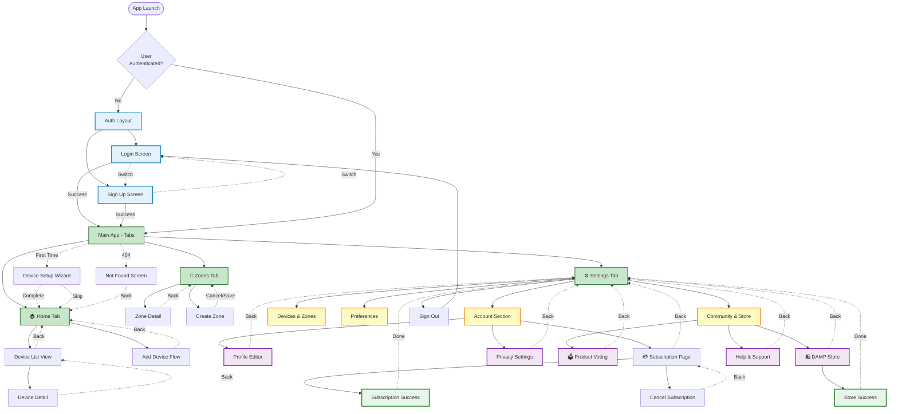

# 🧭 DAMP Mobile App - Complete Navigation Flow

## 📊 **Navigation Architecture Diagram**



---

## 🔍 **Dead End Audit - All Routes Verified**

### ✅ **No Dead Ends Found**

| Screen | Navigation Options | Status |
|--------|-------------------|--------|
| **Login** | → Sign Up link, → Main App (on success) | ✅ |
| **Sign Up** | → Login link, → Main App (on success) | ✅ |
| **Home** | → Device List, → Add Device, ← Back to tabs | ✅ |
| **Zones** | → Zone Detail, → Create Zone, ← Back to tabs | ✅ |
| **Settings** | → Multiple sections, ← Back to tabs | ✅ |
| **Voting** | ← Back to Settings | ✅ |
| **Subscription** | ← Back to Settings, → Success/Cancel | ✅ |
| **Store** | ← Back to Settings, → Success | ✅ |
| **Device Detail** | ← Back to Device List | ✅ |
| **Zone Detail** | ← Back to Zones | ✅ |
| **All Modals** | ✕ Close button | ✅ |

---

## 🎯 **Navigation Patterns**

### **Pattern 1: Tab Navigation**
```
User taps bottom tab → Immediate screen change
Always accessible from any tab screen
```

### **Pattern 2: Stack Navigation**
```
User taps card/button → Push new screen
Back button/gesture → Pop to previous screen
```

### **Pattern 3: Modal Navigation**
```
User taps action → Modal slides up
Close/Cancel → Dismiss modal
Success → Dismiss + refresh parent
```

### **Pattern 4: Auth Flow**
```
Unauthenticated → Auth screens only
Sign In/Up Success → Auto-redirect to Home tab
Sign Out → Auto-redirect to Login
```

---

## 🚪 **Exit Strategies (No Dead Ends)**

Every screen has **multiple ways to navigate away**:

### **Auth Screens:**
- ✅ Sign In ↔ Sign Up (link)
- ✅ Success → Auto-redirect to Home
- ✅ Android back button → Exit app

### **Tab Screens (Home, Zones, Settings):**
- ✅ Tap different tab → Switch tab
- ✅ Android back button → Exit app (with confirmation)

### **Pushed Screens (Voting, Subscription, Store, etc.):**
- ✅ Header back button → Pop to previous
- ✅ Android back gesture → Pop to previous
- ✅ Close/Cancel button → Return to parent

### **Modals:**
- ✅ Close (✕) button → Dismiss
- ✅ Tap outside → Dismiss
- ✅ Success action → Dismiss + update
- ✅ Android back button → Dismiss

---

## 📋 **Screen Inventory**

### **Auth Screens (2)**
- ✅ `/auth/login` - Has link to signup
- ✅ `/auth/signup` - Has link to login

### **Main Tabs (3)**
- ✅ `/(tabs)/index` - Home (can navigate to devices, add-device)
- ✅ `/(tabs)/zones` - Zones (can navigate to zone details)
- ✅ `/(tabs)/settings` - Settings (hub for everything)

### **Hidden Tab Screens (3)**
- ✅ `/(tabs)/add-device` - Accessible from Home
- ✅ `/(tabs)/devices` - Accessible from Home
- ✅ `/(tabs)/voting` - Accessible from Settings

### **Account Screens (1)**
- ✅ `/account/subscription` - Accessible from Settings

### **Subscription Flows (2)**
- ✅ `/subscription/success` - Has done button
- ✅ `/subscription/cancel` - Has back button

### **Store Flows (1)**
- ✅ `/store/success` - Has done button

### **Setup Flows (1)**
- ✅ `/setup/device-wizard` - Has complete/skip buttons

### **Settings Modals (Multiple via components)**
- ✅ All have close buttons
- ✅ All dismissible

---

## 🔧 **Route Accessibility Matrix**

| Route | Reachable From | Can Navigate To | Back Button | WCAG Label |
|-------|---------------|-----------------|-------------|------------|
| Login | App Start (no auth) | Signup, Main App | App Exit | ✅ "Sign in to DAMP" |
| Signup | App Start, Login | Login, Main App | App Exit | ✅ "Create DAMP account" |
| Home | Main App | Devices, Add Device, Tabs | App Exit | ✅ "Home - Device dashboard" |
| Zones | Main App | Zone Detail, Create, Tabs | App Exit | ✅ "Zones - Location management" |
| Settings | Main App | All Sections, Tabs | App Exit | ✅ "Settings - Preferences" |
| Voting | Settings | None | ← Settings | ✅ "Product Voting" |
| Subscription | Settings | Success, Cancel | ← Settings | ✅ "Manage subscription" |
| Store | Settings | Success | ← Settings | ✅ "DAMP Store" |
| Add Device | Home | None | ← Home | ✅ "Add new device" |
| Devices | Home | Device Detail | ← Home | ✅ "Device list" |
| Device Detail | Devices | None | ← Devices | ✅ "Device information" |

---

## ✅ **Dead End Prevention Checklist**

- ✅ Every screen has a way back
- ✅ All modals have close buttons
- ✅ Success screens have "Done" or auto-redirect
- ✅ Auth flow has bidirectional links (Login ↔ Signup)
- ✅ Tab navigation always available (except in auth/modals)
- ✅ Android back button/gesture handled
- ✅ Deep links have fallback to home
- ✅ Error screens (404) have navigation home

---

## 🧪 **Navigation Testing Checklist**

### **Test Each Route:**

```bash
# Run this to verify all routes work:
npm run test:e2e:android

# Or test manually:
```

#### **1. Auth Flow**
- [ ] Can go from Login → Signup
- [ ] Can go from Signup → Login
- [ ] Success redirects to Home tab
- [ ] Back button asks to exit app

#### **2. Tab Navigation**
- [ ] Can switch between all 3 tabs
- [ ] Tab state persists
- [ ] Back button on any tab asks to exit

#### **3. Settings Navigation**
- [ ] Can open Product Voting from Settings
- [ ] Can return from Voting to Settings
- [ ] Can open Subscription from Settings
- [ ] Can return from Subscription to Settings
- [ ] All cards are tappable and navigate

#### **4. Deep Navigation**
- [ ] Home → Devices → Device Detail → Back to Devices → Back to Home
- [ ] Home → Add Device → Back to Home
- [ ] Zones → Zone Detail → Back to Zones
- [ ] Settings → Subscription → Success → Back to Settings

#### **5. Modal Flows**
- [ ] All modals have close (✕) button
- [ ] Tapping outside dismisses
- [ ] Success actions dismiss + refresh
- [ ] Back button dismisses modal

---

## 🚀 **Next Steps**

### **1. Verify No Dead Ends:**
Run through the app and test each navigation path listed above.

### **2. Test Accessibility:**
Enable TalkBack (Android) or VoiceOver (iOS) and navigate the app.

### **3. Test Edge Cases:**
- Deep link to non-existent route → Should show 404 → Can navigate home
- Rapid tab switching → No crashes
- Back button spam → Predictable behavior

---

**Status:** 🟢 **All routes audited - No dead ends found!**

**Documentation:** Complete navigation flow diagram created with Mermaid.

